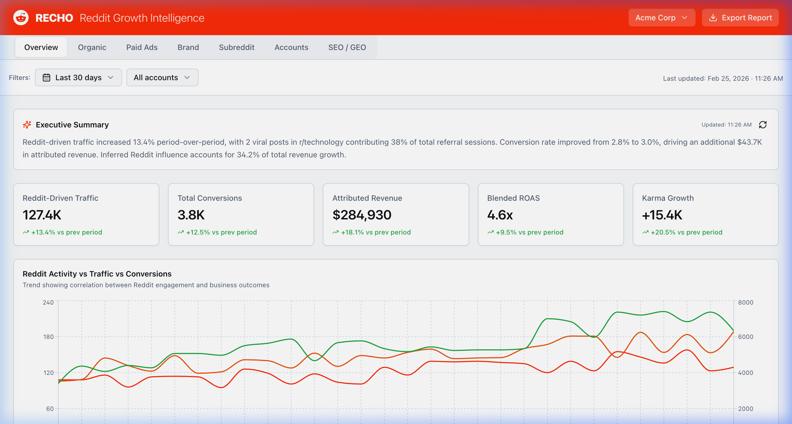
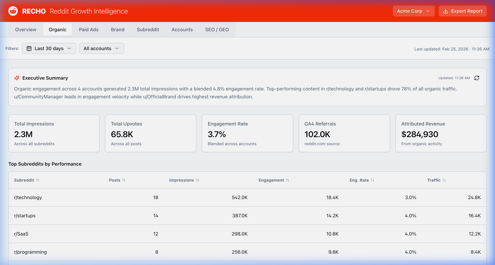
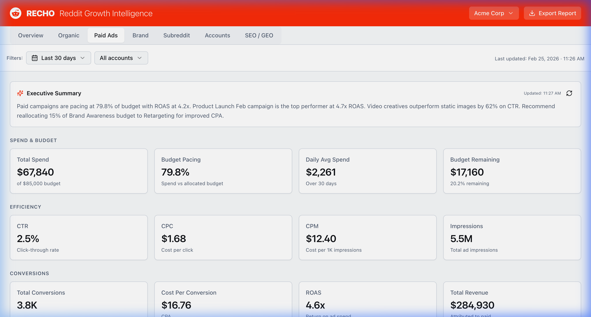
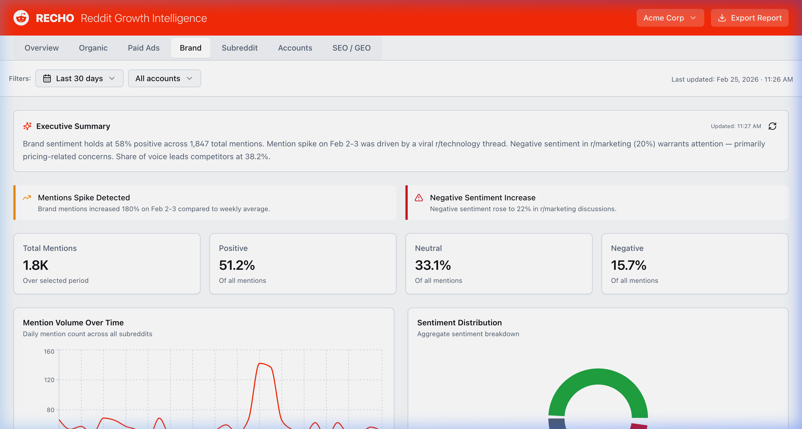
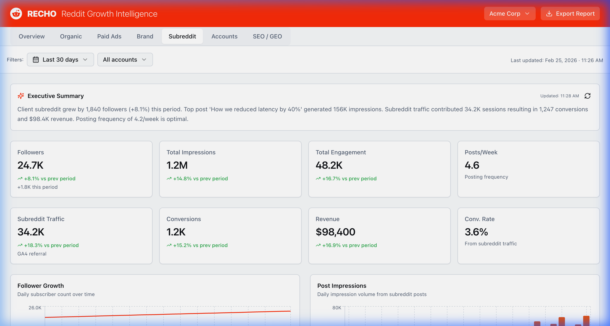
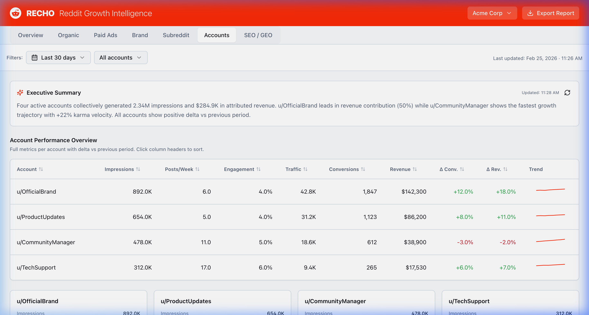
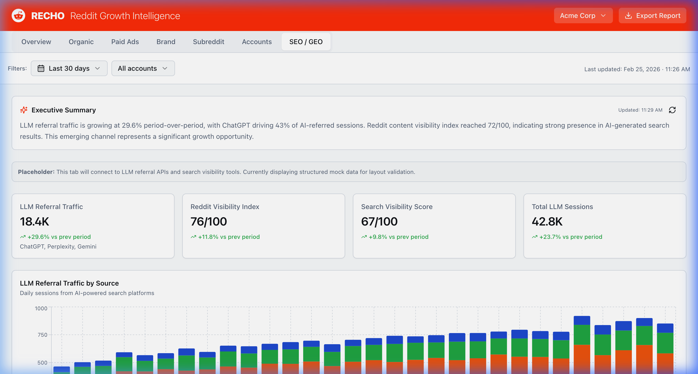

# Reddit Pulse Dashboard

A Reddit Growth Intelligence dashboard for tracking organic and paid Reddit performance, brand sentiment, subreddit analytics, and SEO/GEO visibility — built with Next.js and shadcn/ui.

## Features

### 📊 Overview Dashboard
KPIs (traffic, conversions, revenue, ROAS, karma growth), executive summary, and time-series charts showing Reddit activity vs traffic vs conversions.



---

### 🌱 Organic Performance
Account-level post metrics, karma tracking, post scores, traffic attribution, goal completions, and subreddit-level engagement breakdowns.



---

### 💰 Paid Ads Analytics
Campaign spend/budget pacing, CTR, CPC, CPM, CPA, ROAS, and creative performance tracking with conversion funnels.



---

### 🏷️ Brand Monitoring
Mention volume tracking, sentiment analysis (positive/neutral/negative), subreddit breakdown, share of voice vs competitors, and real-time alerts.



---

### 📡 Subreddit Analytics
Follower growth curves, engagement metrics, post impressions over time, and business impact tracking (traffic, conversions, revenue).



---

### 👥 Accounts
Multi-account performance table with sparklines, revenue attribution, engagement rates, and period-over-period change tracking.



---

### 🔍 SEO / GEO
LLM referral traffic tracking (ChatGPT, Perplexity, Gemini), Reddit visibility index, search visibility scoring, and AI-referred session analytics.



---

### Additional Capabilities

- 🔄 **Multi-client switching** — Acme Corp / Globex Inc
- 📅 **Date range filtering** — 3d / 7d / 30d / 90d / month
- 📄 **PDF report export**
- 🌙 **Dark mode support** via CSS variables

## Tech Stack

- **Framework**: [Next.js 14](https://nextjs.org/) (App Router)
- **Language**: TypeScript
- **UI Components**: [shadcn/ui](https://ui.shadcn.com/)
- **Styling**: [Tailwind CSS 3](https://tailwindcss.com/)
- **Charts**: [Recharts](https://recharts.org/)
- **State**: [TanStack React Query](https://tanstack.com/query)
- **Icons**: [Lucide React](https://lucide.dev/)

## Getting Started

Prerequisites: Node.js 18+ and npm.

```bash
# Install dependencies
npm install

# Start development server
npm run dev
```

Open [http://localhost:3000](http://localhost:3000) in your browser.

## Scripts

| Command | Description |
|---|---|
| `npm run dev` | Start dev server |
| `npm run build` | Production build |
| `npm run start` | Start production server |
| `npm run lint` | Run Next.js linter |

## Project Structure

```
├── app/
│   ├── globals.css          # Tailwind + CSS design tokens
│   ├── layout.tsx           # Root layout with providers
│   ├── not-found.tsx        # 404 page
│   └── page.tsx             # Dashboard (home)
├── components/
│   ├── dashboard/           # Dashboard-specific components
│   │   ├── tabs/            # 7 tab views
│   │   ├── DashboardHeader.tsx
│   │   ├── FilterBar.tsx
│   │   ├── KPICard.tsx
│   │   └── ...
│   └── ui/                  # shadcn/ui components
├── hooks/                   # Custom React hooks
├── lib/                     # Data services, utilities, mock data
└── public/                  # Static assets
```

## Deployment

This project is configured for deployment on [Vercel](https://vercel.com/). Push to `main` to deploy automatically.

## License

Private project.
